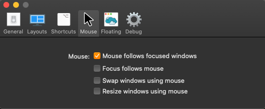

# My MacOS work environment

- `12` desktops for main display (10 + 2 since Amethyst supports direct window
movement between 10 desktops
- `3` desktops for secondary laptop screen

## MacOS Preferences

### Mission Control

### Keyboard Shortcuts

**Note**

Number of visible **Switch to Desktop X** shortcuts, depends on the number of 
desktops you have opened (If you have opened 4 desktops, you will not see
**Switch to Desktop 5** or above). To "fix" this, you can manually create more
desktops and then assign the shortcuts.

| Action           | Keybind |
| -------------------- | --- |
| Switch to Desktop 1  | ⌥ 1 |
| Switch to Desktop 2  | ⌥ 2 |
| Switch to Desktop 3  | ⌥ 3 |
| Switch to Desktop 4  | ⌥ 4 |
| Switch to Desktop 5  | ⌥ 5 |
| Switch to Desktop 6  | ⌥ 6 |
| Switch to Desktop 7  | ⌥ 7 |
| Switch to Desktop 8  | ⌥ 8 |
| Switch to Desktop 9  | ⌥ 9 |
| Switch to Desktop 10 | ⌥ 0 |
| Switch to Desktop 11 | ⌥ - |
| Switch to Desktop 12 | ⌥ = |

## Plugins

### [Amethyst](https://github.com/ianyh/Amethyst)

Tiling window manager for macOS.

#### Settings

Unfortunately, Amethyst currently does not support exporting/importing settings.

##### General

##### Layouts

**Layouts updated**

 - Column
 - Widescreen Tall
 - Floating

##### Keybinds

##### Mouse

##### Floating

### [Rectangle](https://github.com/rxhanson/Rectangle)

Exported Rectangle config is located in `resources/RectangleConfig.json`

#### Settings

##### Keybinds

##### Options

## App specific keyboard shortcuts

### Global

Applying this globally for all installed applications will prefent accidentally
hiding all open applications.

| Action                                  | Keybind   |
| --------------------------------------- | --------- |
| Hide Others                             | ^ ⌥ ⇧ ⌘ ] |
| Hide `{Application}`                    | ^ ⌥ ⇧ ⌘ ] |

### iTerm2

| Action                                  | Keybind   |
| --------------------------------------- | --------- |
| New Tab with Current Profile            | ⇧ ⌘ T     |
| Split Vertically with Current Profile   | ^ \       |
| Split Horizontally with Current Profile | ⌘ \       |
| Close                                   | ^ ⇧ W     |
| Hide Others                             | ^ ⌥ ⇧ ⌘ ] |
| Hide iTemr2                             | ^ ⌥ ⇧ ⌘ ] |

### Other

There is always more ...