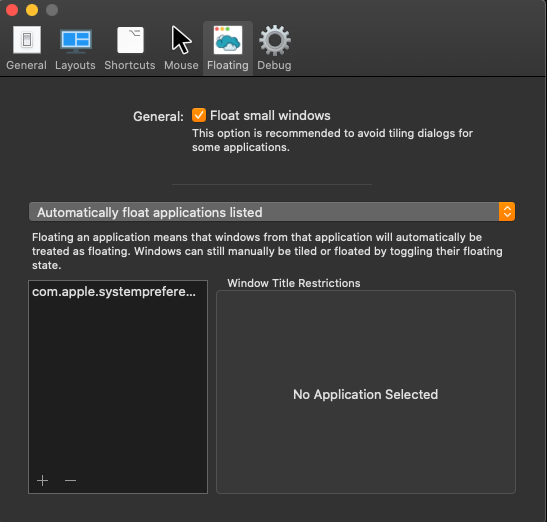

# My MacOS work environment

I am using "10 static desktops" that span across both displays. I haven't tested
this configuration with different displays having separate desktops each.

## MacOS Preferences

### Mission Control

### Keyboard Shortcuts

**Note**

Number of visible **Switch to Desktop X** shortcuts, depends on the number of 
desktops you have opened (If you have opened 4 desktops, you will not see
**Switch to Desktop 5** or above). To "fix" this, you can manually create more
desktops and then assign the shortcuts.

## Plugins

### [Amethyst](https://github.com/ianyh/Amethyst)

Tiling window manager for macOS.

#### Settings

Unfortunately, Amethyst currently does not support exporting/importing settings.

##### General

##### Layouts

##### Keybinds

##### Mouse

##### Floating

### [Rectangle](https://github.com/rxhanson/Rectangle)

Exported Rectangle config is located in `resources/RectangleConfig.json`

#### Settings

##### Keybinds

##### Options

### Other

There is always more ...